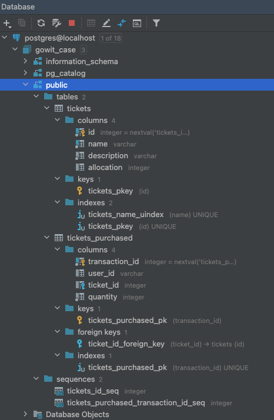

# Ticket Api

Main dependencies:

- HTTP Server: [echo](https://echo.labstack.com/)
- Database access: [database/sql](https://pkg.go.dev/database/sql)
- Lint: [golangci-lint](https://github.com/golangci/golangci-lint)
- Importing PostgreSQL Driver: [pq](github.com/lib/pq)
- Swagger: [echo-swagger](https://github.com/swaggo/echo-swagger)
- Mock: [golang/mock](https://github.com/golang/mock)
- Test Assertions: [stretchr/testify](https://github.com/stretchr/testify)

## Requirements
- [x] You need to dockerize your app
- [x] You need to write Unit Tests to your app
- [x] Also open api documentation required

## Project Layout

```
.
├── Dockerfile
├── Makefile
├── db.go
├── docs
│   ├── docs.go
│   ├── swagger.json
│   └── swagger.yaml
├── go.mod
├── go.sum
├── internal
│   └── ticket
│       ├── handler
│       │   ├── handler.go
│       │   ├── handler_test.go
│       │   └── request.go
│       ├── mocks
│       │   ├── repository.go
│       │   └── service.go
│       ├── model.go
│       ├── repository
│       │   └── repository.go
│       └── service
│           ├── service.go
│           └── service_test.go
├── main.go
├── unit_coverage.html
└── unit_coverage.out

7 directories, 20 files
```

## Getting Started

```sh
# download the project
git clone https://github.com/dilaragorum/ticket-api.git

cd ticket-api
```

```
# You must have a postgresql up and running.

# You have to create two tables.

1- tickets
    id          serial  primary key,
    name        varchar not null,
    description varchar not null,
    allocation  integer

2- tickets_purchased
    transaction_id serial primary key,
    user_id        varchar,
    ticket_id      integer --> Must be foreign key,
    quantity       integer not null
```



```sh
# build application

make docker-build

# run application

make docker-run
```

# Go To Swagger URL
http://localhost:3000/swagger/index.html


## My assumption for the business rules not mentioned in the case

- Ticket Option name must be unique.
- Ticket Option name and description cannot be empty.
- To see user purchased history, I use `transaction_id` while keeping old records in the database under the
`tickets_purchased` table.